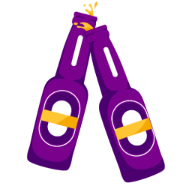

<h1 align="center">SkyBar</h1>
<p align="center">
Experimente as melhores bebidas da região.
</p>
<p align="center">
  
</p>

## :rocket: Tecnologias utilizadas:

- [React](https://pt-br.reactjs.org/)
- [NextJS](https://nextjs.org/)
- [ChakraUI](https://chakra-ui.com/)
- [React Hook Form](https://react-hook-form.com/)
- [Yup](https://github.com/jquense/yup)
- [Zustand](https://zustand-demo.pmnd.rs/)
- [Supabase](https://supabase.com/)
- [Framer Motion](https://www.framer.com/motion/)

## 🔨 How to use

In terminal use:

```bash
# npm
npx create-next-app -e https://github.com/SkyG0D/next-boilerplate

# yarn
yarn create next-app -e https://github.com/SkyG0D/next-boilerplate
```

## ❤️ Contributions

Open a PR to contribute to the project.
